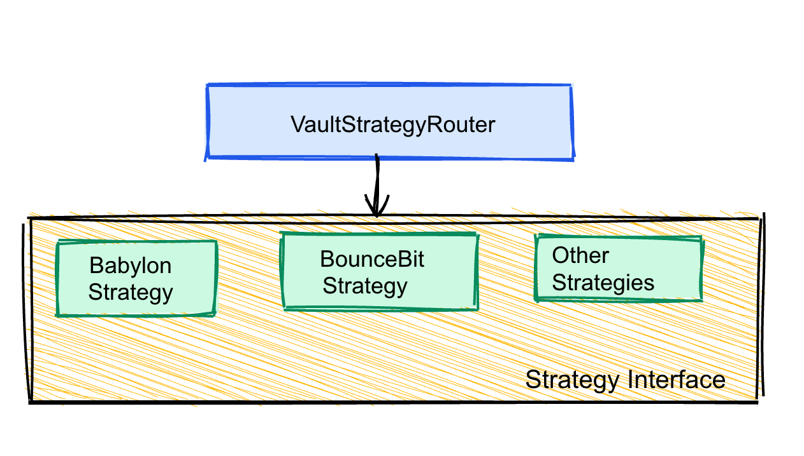

# LayerBTC Vault Strategy Router

## Overview
A modular, production-grade vault router for BTCFi protocols. It dynamically routes BTC assets (e.g., stBTC, bridged BTC, synthetic BTC) to the best-performing yield strategies (Babylon, BounceBit, etc.), supports dynamic rebalancing, and is designed for extensibility and security.

---

## Architecture




- **VaultStrategyRouter**: Core contract, manages deposits, withdrawals, strategy selection, and rebalancing.
- **Strategies**: Modular contracts (Babylon, BounceBit, etc.) implementing the `IStrategy` interface.

---

## Roles & Permissions
- **ADMIN_ROLE**: Can pause/unpause, emergency withdraw, manage roles.
- **KEEPER_ROLE**: Can trigger APY sync and rebalancing.
- **STRATEGY_MANAGER_ROLE**: Can add/remove strategies.

---

## Security Considerations
- Reentrancy guards on all fund-moving functions
- Role-based access control (RBAC) for all sensitive actions
- Input validation and custom errors
- Emergency pause and withdraw
- Uses OpenZeppelin libraries for security


---

## Deployment & Configuration
1. Deploy `MockStBTC` (BTC asset)
2. Deploy `VaultStrategyRouter` with asset, admin, keeper
3. Deploy strategies (Babylon, BounceBit, ...)
4. Set router address in each strategy
5. Add strategies to router
6. Set initial APYs (mock)
7. Run keeper to sync APYs

See `scripts/deploy.js` for an automated example.

---

## How Strategies Work (Mock)
- Each strategy contract implements `IStrategy`.
- APY is settable for testing; in production, would use oracles or protocol data.
- Only the router can deposit/withdraw.

---

## Example Test Coverage
- Role-based access control (including role revocation)
- Deposit/withdraw logic (including multi-user, edge cases, and event parameter checks)
- Rebalancing and APY sync (including threshold logic and event emission)
- Emergency flows (pause, emergency withdraw, withdraw from deactivated strategy)
- Strategy management (add/remove/activate, duplicate add protection)
- Event emission (withArgs checks)

---

## Advanced & Edge-Case Test Scenarios
- Multi-user deposits and withdrawals
- Withdraw from deactivated strategies
- Role revocation enforcement
- Duplicate strategy add protection
- Emergency withdraw with funds in multiple strategies
- Event parameter correctness (using event logs)


---

## Setup

1. **Install dependencies:**
   ```sh
   npm install
   ```
2. **Compile contracts:**
   ```sh
   npx hardhat compile
   ```

---

## Testing

- **Run all tests:**
  ```sh
  npx hardhat test
  ```
- The test suite covers:
  - Access control (roles, revocation)
  - Deposit/withdraw (multi-user, edge cases, event args)
  - Rebalancing logic and events
  - Emergency flows (pause, emergency withdraw)
  - Strategy management (add/remove/activate, duplicate add protection)
  - Advanced/edge-case scenarios

---

## License
MIT
